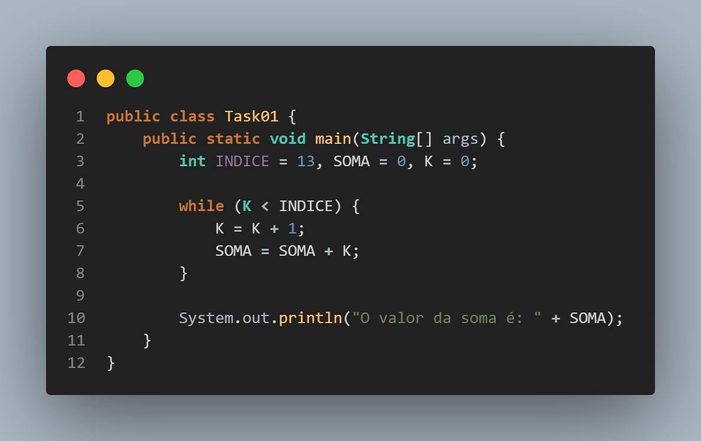

# Teste Técnico

Este é um teste técnico contendo várias questões relacionadas a programação. Cada questão será acompanhada de uma breve explicação e uma imagem representativa do código correspondente.

## 1) Valor da variável SOMA

**Descrição:** Este código calcula a soma dos números de 1 a 13 e imprime o resultado.



---

## 2) Sequência de Fibonacci

**Descrição:** Neste problema, devemos escrever um programa que calcule a sequência de Fibonacci até um determinado número informado pelo usuário. O código irá verificar se o número fornecido pertence à sequência de Fibonacci.


---

## 3) Próximo Elemento em Sequências

**Descrição:** Para cada uma das sequências fornecidas, devemos encontrar e completar o próximo elemento.


---

## 4) Descobrindo Interruptores e Lâmpadas

**Descrição:** Neste problema, estamos em uma sala com três interruptores, cada um conectado a uma lâmpada em uma sala diferente. Devemos descobrir qual interruptor controla cada lâmpada usando apenas duas idas até uma das salas das lâmpadas.


---

## 5) Invertendo Caracteres de uma String

**Descrição:** O objetivo deste problema é escrever um programa que inverta os caracteres de uma string sem usar funções prontas.


---

## Como Clonar o Repositório

Para clonar este repositório, siga as instruções abaixo:

1. Abra o terminal ou prompt de comando.
2. Navegue até o diretório onde deseja clonar o repositório.
3. Execute o seguinte comando:

```
git clone https://github.com/AndersonSantos07/TesteTecnicoTarget/tree/main
```
